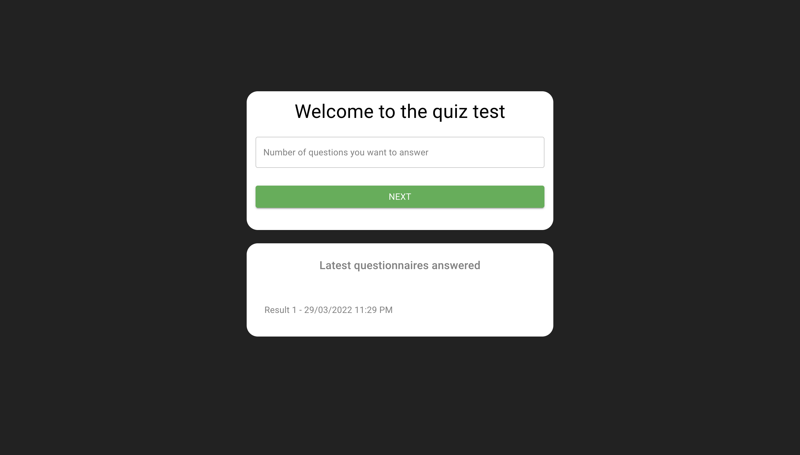

<h1 align="center">
    
</h1>

# Questionary

Aplicação com intuito didático, desenvolvida com NextJS, Context API e Material UI.

# O que é?

💻 É um questionário dinâmico onde o usuário seleciona a quantidade de perguntas que deseja responder e ao final exibe o total de acertos e erros, com as perguntas e respostas de acordo com o selecionado pelo usuário.

## :camera: Resultado:


## :rocket: Tecnologias

<table>
  <thead>
    <th>NextJS</th>
  </thead>
  <tbody>
    <tr>
      <td>Material UI</td>
    </tr>
    <tr>
      <td>Axios</td>
    </tr>
    <tr>
      <td>React Hooks</td>
    </tr>
    <tr>
      <td>Eslint</td>
    </tr>
    <tr>
      <td>Prettier</td>
    </tr>
    <tr>
      <td>Context API</td>
    </tr>
  </tbody>

</table>

## Configuração para Desenvolvimento

Para instalar basta seguintes passos:

```sh
git clone
cd pastaDoProjeto
yarn ou npm install
yarn dev
```
